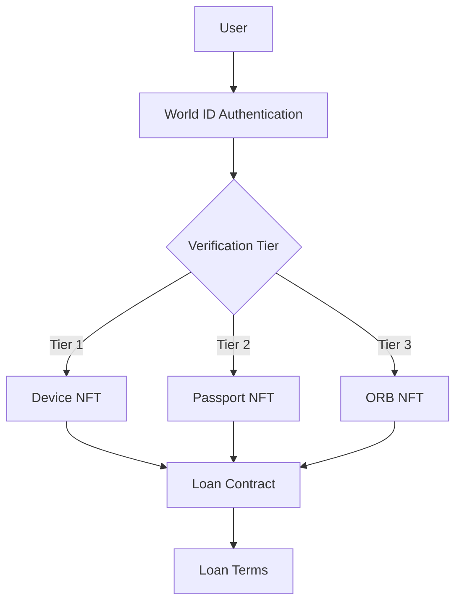

# Magnify World App V2 🌟

## Overview

Magnify World App V2 is a modern DeFi dashboard and lending platform that integrates cutting-edge NFT verification alongside dynamic loan management. Built with React, TypeScript, and Vite—and powered by Supabase for backend services—the platform leverages World ID credentials and NFT collateral to offer undercollateralized loans based on three verification tiers: Device, Passport, and ORB.

## Table of Contents

1. [Overview](#overview)
2. [Features](#features)
3. [Technical Stack](#technical-stack)
4. [Architecture](#architecture)
5. [NFT Verification System](#nft-verification-system)
6. [Loan Management](#loan-management)
7. [Smart Contract Integration](#smart-contract-integration)
8. [Frontend & State Management](#frontend--state-management)
9. [Security Considerations](#security-considerations)
10. [Deployment & Environment Variables](#deployment--environment-variables)
11. [Development & Contribution Guidelines](#development--contribution-guidelines)
12. [Future Improvements](#future-improvements)
13. [License](#license)

## Features

- **NFT Verification System**  
  - Three-tier verification using World ID credentials.
  - Minting of tier-specific NFTs that serve as collateral for loans.
- **Dynamic Loan Management**  
  - Under-collateralized loans based on user verification tier.
  - Extended functionality in the V2 contract, including Permit2 integration for secure token transfers during repayments.
- **User Management**  
  - Profile dashboard with NFT collateral and loan activity displays.
  - Secure authentication powered by Supabase.
- **Responsive & Modern UI**  
  - Built with React, Tailwind CSS, and shadcn/ui components.
  - Adaptable design for mobile, tablet, and desktop experiences.
- **Monitoring & Analytics**  
  - Sentry integration for production error tracking.
  - Eruda debugging for selected developer wallet addresses.

## Technical Stack

- **Frontend:** React 18, TypeScript, Vite, Tailwind CSS, shadcn/ui, Framer Motion.
- **Backend:** Supabase (Authentication, PostgreSQL, Real-time Subscriptions, Edge Functions).
- **Blockchain:** Ethereum integration via Wagmi, World ID SDK, Worldcoin Minikit.
- **Smart Contracts:** Solidity contracts built on OpenZeppelin libraries (see V1 and V2 versions).

## Architecture

The application is divided into several core subsystems:

- **NFT Verification System:**  
  Handles World ID authentication flows, tier-based verification, and NFT minting.

- **Loan Management:**  
  Processes loan requests, calculates loan eligibility based on NFT collateral, handles repayments via Permit2, and manages collateral release.

- **Smart Contract Integration:**  
  Communicates with legacy (V1) and updated (V2) contracts for loan and NFT state, ensuring smooth transitions between versions.

- **Frontend & State Management:**  
  Uses TanStack Query and custom React hooks (e.g., `useMagnifyWorld`, `useRepayLoan`) for efficient data fetching, caching, and state synchronization.

Below is an illustrative architecture diagram:



## NFT Verification System

The NFT Verification System utilizes World ID credentials to mint tier-specific NFTs that serve as collateral:

- **Process Flow:**  
  1. The user initiates authentication via the World ID interface.
  2. The system validates the credential via the Worldcoin backend.
  3. A smart contract mints an NFT corresponding to the user's verification tier.
  4. NFT metadata determines the user's loan eligibility.

- **Key Components:**  
  - **UpgradeVerification UI:** Provides an interactive interface for the user to upgrade their verification status.
  - **useMagnifyWorld Hook:** Manages the mapping of tier IDs to verification levels, caching NFT data, and handling tier state.

Example snippet:
```typescript
// useMagnifyWorld hook snippet
const { data, refetch } = useMagnifyWorld(walletAddress);
const currentTier = data?.nftInfo.tier?.verificationStatus;

// Cache invalidation for wallet data
export function invalidateCache(walletAddress: `0x${string}`) {
  delete globalCache[walletAddress];
}
```

## Loan Management

Loan management leverages NFT collateral to provide undercollateralized loans:

- **Loan Request Process:**  
  1. The user requests a loan by using their NFT as collateral.
  2. The system validates NFT ownership and eligibility (based on tier parameters).
  3. The loan is issued from the smart contract if sufficient funds are available.

- **Loan Repayment:**  
  - Uses Permit2 functionality for secure, permissioned token transfers to repay loans.

- **Contract Integration:**  
  - The V2 contract extends functionalities from V1, incorporating new events (`LoanRequested`, `LoanRepaid`, `LoanTokensWithdrawn`) and backward compatibility queries.

Representative V2 contract snippet:
```solidity
function requestLoan() external nonReentrant {
    uint256 tokenId = v1.userNFT(msg.sender);
    require(tokenId != 0, "No NFT owned");
    require(IERC721(address(v1)).ownerOf(tokenId) == msg.sender, "Not NFT owner");
    uint256 tierId = v1.nftToTier(tokenId);
    require(tierId != 0 && tierId <= v1.tierCount(), "Invalid tier parameters");

    // Check for active loans on V1 and V2
    ( , , bool activeOnV1, , ) = v1.loans(tokenId);
    require(!activeOnV1, "Active loan on V1");
    require(!v2Loans[tokenId].isActive, "Active loan on V2");

    // Issue loan based on tier parameters
    (uint256 loanAmount, uint256 interestRate, uint256 loanPeriod) = v1.tiers(tierId);
    require(loanToken.balanceOf(address(this)) >= loanAmount, "Insufficient contract balance");

    v2Loans[tokenId] = Loan(
        loanAmount,
        block.timestamp,
        true,
        interestRate,
        loanPeriod
    );
    require(loanToken.transfer(msg.sender, loanAmount), "Transfer failed");
    emit LoanRequested(tokenId, loanAmount, msg.sender);
}
```

## Smart Contract Integration

The project's smart contract layer consists of two versions:

- **MagnifyWorld V1:**  
  Provides the core NFT minting, verification, and loan issuance functionalities with mappings for user NFTs and tier associations.

- **MagnifyWorld V2:**  
  Extends V1 functionality by offering dynamic loan management, incorporating Permit2 usage for repayments, and providing comprehensive read-only queries for NFT tiers, user loans, and tier counts.

Developers can review complete function definitions and events in the `/contracts` directory.

## Frontend & State Management

- **Routing & Protected Pages:**  
  The app uses React Router. Protected routes ensure that only authenticated users access pages like Profile, Wallet, and Loan.

Example route:
```jsx
<Route path="/upgrade-verification" element={
  <ProtectedRoute>
    <UpgradeVerification />
  </ProtectedRoute>
} />
```

- **State & Data Caching:**  
  Custom hooks such as `useMagnifyWorld` and `useRepayLoan` manage data from the blockchain and backend via TanStack Query.

- **Component Structure:**  
  Components are organized under `src/components/`, including the Dashboard, Header, and reusable UI elements.

## Security Considerations

Security is integrated throughout the system:

- **Proof Validation:**  
  Implements zero-knowledge standards with short expiration windows to validate World ID proofs.

- **Rate Limiting:**  
  Enforces cooldown periods between verification attempts using smart contract modifiers:
```solidity
modifier checkCooldown() {
  require(block.timestamp > lastVerificationAttempt[msg.sender] + VERIFICATION_COOLDOWN, "Cooldown active");
  _;
}
```

- **Data Privacy:**  
  Employs encryption for sensitive proof storage and minimizes exposure of credential data.

- **Contract Safeguards:**  
  Both V1 and V2 contracts include robust ownership and NFT state validations to prevent unauthorized loan requests.

## Deployment & Environment Variables

Before deployment, create a `.env` file in the project root with the following variables:

```env
VITE_SUPABASE_URL=your_supabase_url
VITE_SUPABASE_ANON_KEY=your_supabase_anon_key
VITE_SENTRY_DSN=your_sentry_dsn
```

Deployment methods include:
- Lovable's built-in deployment solution.
- Manual deployment with platforms such as Netlify.

## Development & Contribution Guidelines

Contributions are welcome! Please follow these steps:

1. **Fork the repository** and create your feature branch.
2. **Follow the coding standards** – use TypeScript, adhere to ESLint/Prettier, ensure 80%+ test coverage.
3. **Submit detailed pull requests** with appropriate documentation and tests.

Further resources:
- [Lovable Documentation](https://docs.lovable.dev/)
- [shadcn/ui Documentation](https://ui.shadcn.com/)
- [Supabase Documentation](https://supabase.com/docs)

## Future Improvements

- **Credit History System:**  
  Tracking repayment data to establish a user credit score.
- **Enhanced Liquidity Pools:**  
  New DeFi features for automated market making.

## License

This project is licensed under the MIT License. See the [LICENSE](./LICENSE) file for details.

---

_Last Updated: February 19 2025_